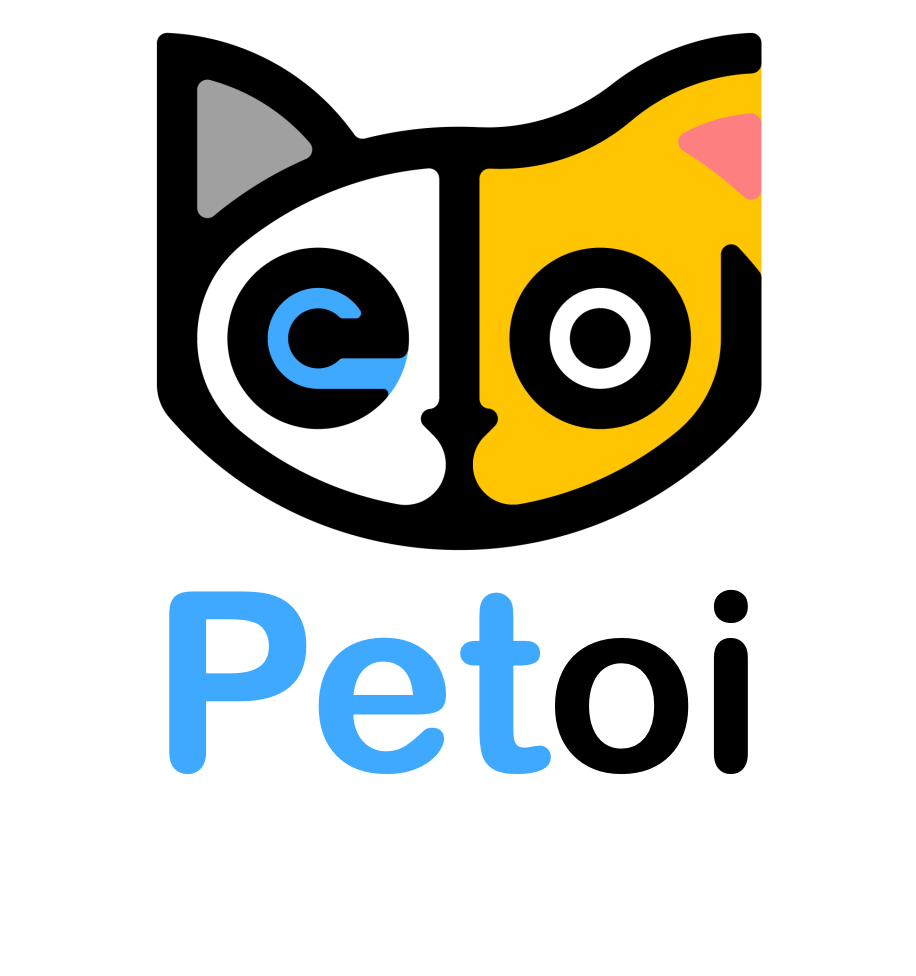

# Petoi Mind+ Expansion Library 
### A block-based drag-and-drop programming tool for Petoi robots. 


---------------------------------------------------------

## Table of Contents
- [Petoi Mind+ Expansion Library](#petoi-mind-expansion-library)
  - [Table of Contents](#table-of-contents)
  - [URL](#url)
  - [Summary](#summary)
  - [How to use](#how-to-use)
  - [Examples](#examples)
  - [License](#license)
  - [Supported targets](#supported-targets)
  - [Release Logs](#release-logs)

## URL
* Project URL : ```https://github.com/PetoiCamp/Petoi_MindPlusLib```

## Summary
Use the user library of Mind+V1.7.3 and above to load this extension to control the Petoi robot.
It allows to schedule movements, play music, and access to the GPIO pins.


## How to use
Download and install [Mind+ Desktop app](https://mindplus.dfrobot.com).

Input the project URL: **https://github.com/PetoiCamp/Petoi_MindPlusLib** in the interface to import this library as follows:


For macOS (<=V1.7.2 RC3.0), you need to download [PetoiRobot.zip](https://github.com/PetoiCamp/Petoi_MindPlusLib/raw/main/PetoiRobot.zip) first, and copy the extracted folder (**PetoiRobot**) to
 **/Users/{your username}/Documents/mindplus-py/environment/Python3.6.5-64/lib/python3.6/site-packages/**

* Before running the program, we recommend you [upgrade your robot to the newest firmware](https://bittle.petoi.com/3-NyBoard-Configuration) for the best compatibility. The standard firmware should support most of the coding blocks. However, you will need to use the **GROVE_SERIAL_PASS_THROUGH** mode to access the IO pins.
 


## Examples
The following examples can be found in [examples/](https://github.com/JasonWong08/ext-petoi_robot/tree/main/examples) folder and opened by the Mind+ APP directly.

Play melody (/examples/PlayMelody.mp)


Execute skills (/examples/ExecuteSkills.mp)


Turn around (/examples/TurnAround.mp)


Write the value of digital pin (/examples/WriteDigital.mp)


Write the value of analog pin ((/examples/WriteAnalog.mp)


Read the random values of analog pin and turn them into music tones ((/examples/ReadAnalog.mp)


Control the robot's joints and play melody ((/examples/Robot.mp)


## License

MIT

## Supported targets

MCU                | JavaScript    | Arduino   | MicroPython    | Python
---------------- | :------------: | :---------: | :---------------: | ----------
arduino            |                     |                 |                          |       √
esp32               |                     |                 |                          |       √


## Release Logs
* V0.0.1  Basic functions completed.

## Link to the [online store](https://www.petoi.com/collections/robots) for the robots' hardware. 
