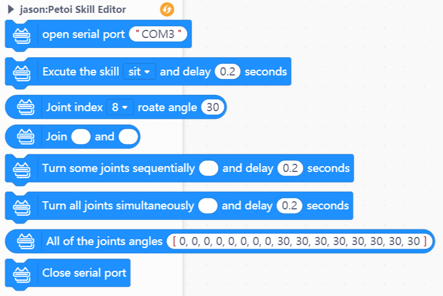
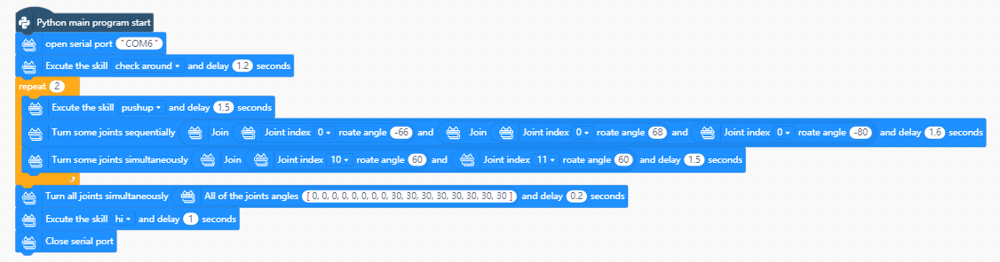

# Petoi Robot


---------------------------------------------------------

## Table of Contents

* [URL](#url)
* [Summary](#summary)
* [Blocks](#blocks)
* [License](#license)
* [Supported targets](#Supportedtargets)

## URL
* Project URL : ```https://github.com/JasonWong08/ext-petoi_robot```
* Get a purchase connection: [store](https://www.petoi.com/collections/robots).

## Summary
Use the user library of Mind+V1.7.3 and above to load this extension to control the Petoi robot to show various skills.

## Blocks




## Examples



## License

MIT

## Supported targets

MCU                | JavaScript    | Arduino   | MicroPython    | Python
---------------- | :------------: | :---------: | :---------------: | ----------
arduino            |                     |                 |                          |       √
esp32               |                     |                 |                          |       √


## Release Logs
* V0.0.1  Basic functions completed.